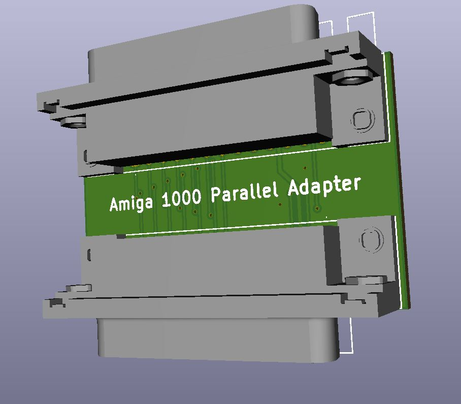

# Amiga 1000 Parallel Port Converter
This adapter plugs into the rear of the Amiga 1000 on the parallel port to change the pinout for non-Amiga 1000 parallel devices.

## Info
* Order the PCB from your PCB fab of choice. (JLCPCB, PCBway, OSH Park, etc.)
* Solder two DB25 female connectors to the board.
* This project has been tested and working with a DCTV.

## Other
This project is open source. Feel free to do what you want with it.
